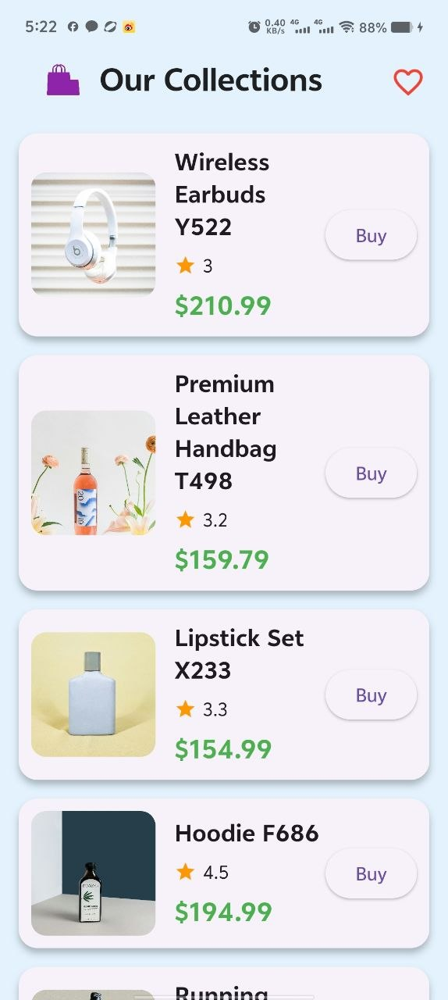
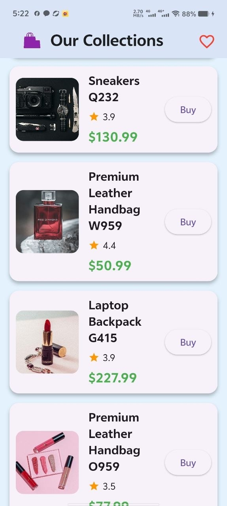
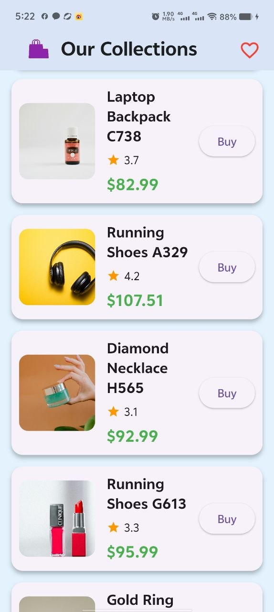
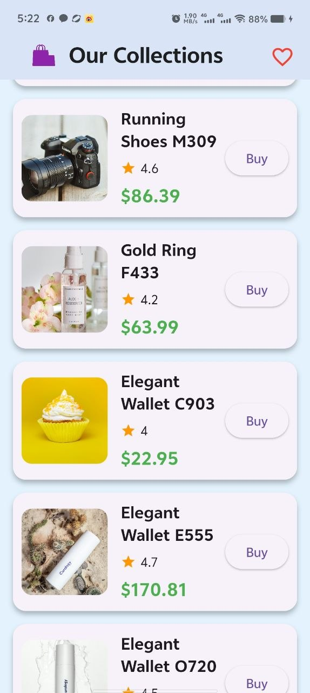
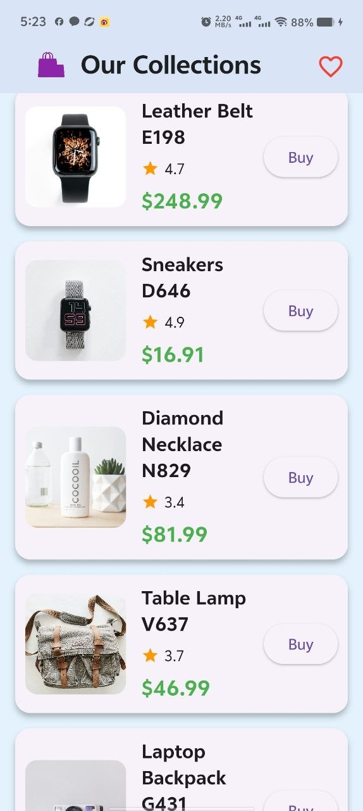

# Api_integrate_products

**Api_integrate_products** is a small Flutter example app that fetches 100  products data from a PHP API and displays them in a scrollable list. It demonstrates a simple backend-generator plus a Flutter frontend that consumes JSON, formats data, and resolves product images using a base image URL.

**Features**
- Fetch products JSON from `https://hadi.olivosoft.com/products.php`.
- Backend (`products.php`) generates 100 own products and is configured to return all products in a single response (no pagination).
- Frontend (`lib/product_screen.dart`) parses the API `products` array safely, formats prices, and builds image URLs using the base path `https://hadi.olivosoft.com/images/` with the pattern `product_<id>.jpg` (e.g. `product_1.jpg`).
- Displays product name, rating, price, image (with loading and error placeholders), and a Buy button.

**Files of interest**
- `products.php` — generator API that returns JSON with a `products` key (contains product objects).
- `lib/profile_screen.dart` — Flutter screen that requests the API, parses the response, constructs image URLs, and renders the list UI.


**Notes & troubleshooting**
- Images are resolved by ID using `https://hadi.olivosoft.com/images/product_<id>.jpg`. If images show broken placeholders, verify those image files exist on the server (test with `curl -I https://hadi.olivosoft.com/images/product_1.jpg`).
- The app now handles multiple JSON shapes by checking for `products` or `data` arrays and falls back to a top-level list if present.
- If you want pagination instead of returning all 100 items at once, revert the pagination section in `products.php` and use `page`/`perPage` query parameters.

If you want, I can also add a simple mock of images or adjust the UI spacing/styling further.

**Backend & Hosting**
- The PHP backend (`products.php`) was developed and hosted by the project author at `https://hadi.olivosoft.com`. The Flutter app fetches product JSON from `https://hadi.olivosoft.com/products.php` and resolves product images from `https://hadi.olivosoft.com/images/product_<id>.jpg` (for example `product_1.jpg`). This setup was implemented to provide a self-contained API and image hosting for development and demo purposes.


## Project UI 

<p align="center">
  
  &nbsp;&nbsp;&nbsp;
  
  &nbsp;&nbsp;&nbsp;
  
  &nbsp;&nbsp;&nbsp;
  
  &nbsp;&nbsp;&nbsp;
  
  
</p>

**Dependencies**
- Flutter SDK
- `http` package (added to `pubspec.yaml`) for API requests
- `assets` folder include in `pubspec.yaml` 

**How to run**
1. Ensure Flutter is installed and an emulator or device is available.
2. Get packages:

```bash
flutter pub get
```

3. Run the app:

```bash
flutter run
```


## Notes

This project is a UI-focused demo for learning Flutter layout,handling, and custom widgets. It is not a complete backend-powered e-commerce app.